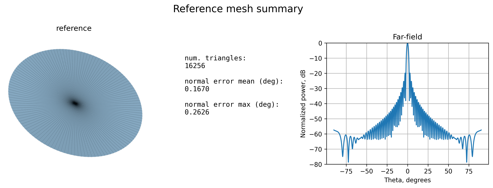
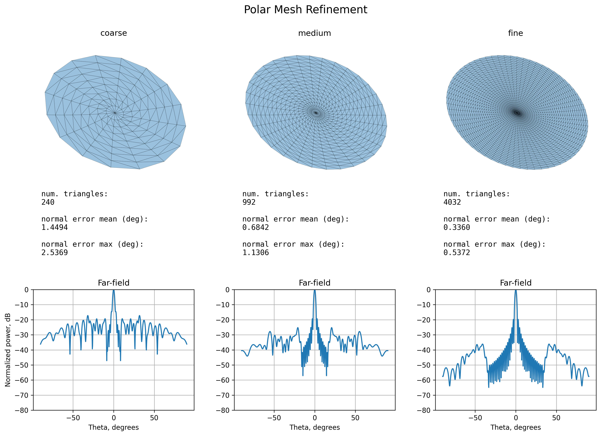
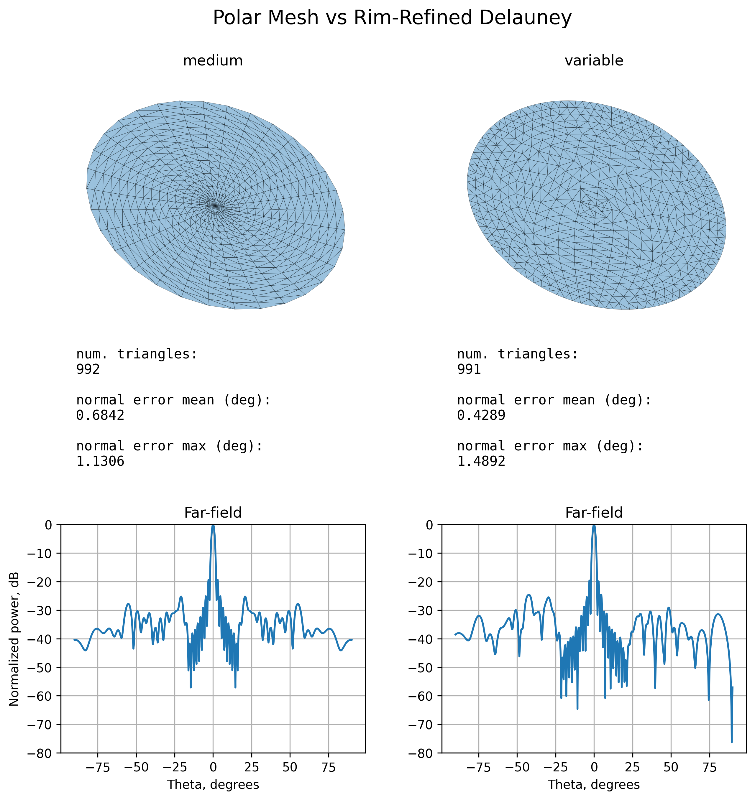

# Antenna Reflector Meshing

Exploration of meshing impact on far-field power pattern for a simple antenna reflector.

Using physical optics model for the far-field pattern.

## Results

### Refining polar mesh

Starting with a simple polar mesh, use a lot of triangles to get a reference far-field pattern:

<br>



<br>

Now varying the detail of the mesh.
- The normals improve and the far-field pattern converges as the meshing gets finer.
- The central region becomes stable first - high angles are more sensitive to the mesh error.

<br>



<br>

### Non-uniform Delauney

Tried a Delauney triangulation with progressively more vertices towards the rim.

Tuned numbers until it used the same number of triangles as the medium polar mesh.

My thought was that the rim boundary might be more important than the inner triangles. Results inconclusive:
- The far-field pattern is much more irregular because symmetry was lost.
- Central region may have converged a bit more.

Should have compared with non-variable Delauney as well.

<br>



<br>

## Brief physics / model overview

### Antenna reflector

The reflector dish was defined like this:

$$
z = \frac{x^2 + y^2}{4f}
$$

where $\mathbf{r}_f = (0, 0, f)$ is the focus.

This shape makes rays from the feed reflected by the dish leave in parallel, when the feed is placed at the focus.

### Computation of far-field power pattern

#### 1. Calculate incident magnetic field for each triangle $n$

$$
\tilde{\mathbf{H}}_{\mathrm{inc},n}
=
H_0
\frac{e^{-jkR_n}}{R_n}
\hat{\mathbf{h}}_n
$$

$$
R_n = \left\lVert \mathbf{r}_n - \mathbf{r}_f \right\rVert
$$

$$
\hat{\mathbf{R}}_n
=
\frac{\mathbf{r}_n - \mathbf{r}_f}{R_n}
$$

where $\tilde{\mathbf{H}}_{\mathrm{inc}}$ is the incident magnetic field, $H_0$ is the reference amplitude, $\mathbf{r}_f$ is the position of the feed, $\mathbf{r}_n$ are the triangle centers, $k$ is the wavenumber $\frac{2\pi}{\lambda}$, and the direction of the field $\hat{\mathbf{h}}$ is perpendicular to the incoming wave.

The incoming field declines in amplitude and changes phase as the distance to the surface $R$ increases.

#### 2. Calculate surface current for each triangle $n$

Using physical optics instead of a full-wave electromagnetic solution:

$$
\tilde{\mathbf{J}}_{s,n}
=
2\hat{\mathbf{n}}_n
\times
\tilde{\mathbf{H}}_{\mathrm{inc},n}
$$

where $\mathbf{J}_s$ is the surface current and $\hat{\mathbf{n}}$ is the triangle normal.

The physical optics model has many limitations, such as assuming each illuminated surface patch behaves like a locally flat perfect conductor, and ignoring many electromagnetic effects - but, it still gives a wave-based far-field pattern when the estimated surface currents are integrated over the reflector.

#### 3. Integrate surface currents

For an observation direction $\hat{\mathbf{r}}_v$

$$
\mathbf{F}(\hat{\mathbf{r}}_v)
=
\sum_{n=1}^{N}
\tilde{\mathbf{J}}_{s,n}
A_n
e^{jk\hat{\mathbf{r}}_v\cdot\mathbf{r}_{n}}
$$

where $\mathbf{F}$ is a phased sum of current contributions and $A$ are the triangle areas.

Here, $\mathbf{r}_n$ is projected onto $\hat{\mathbf{r}}_v$ to get the relevant phase for that particular viewing direction.

#### 4. Calculate far-field pattern

The far-field will vary in intensity and phase due to distance, but will be proportional to the far-field pattern.

The far-field pattern itself is proportional to the part of the phased current sum orthogonal to the viewing direction:

$$
\mathbf{E}_{\mathrm{pattern}}(\hat{\mathbf{r}}_v)
\propto
\mathbf{F}(\hat{\mathbf{r}}_v)
-
\left(
\mathbf{F}(\hat{\mathbf{r}}_v)\cdot\hat{\mathbf{r}}_v
\right)
\hat{\mathbf{r}}_v
$$

The power is proportional to the squared magnitude of the electric field:

$$
P(\hat{\mathbf{r}}_v)
\propto
\left\lVert
\mathbf{E}_{\mathrm{pattern}}(\hat{\mathbf{r}}_v)
\right\rVert^2
$$

## Running Instructions

```bash
pip install -r requirements.txt
```

```bash
python main.py
```